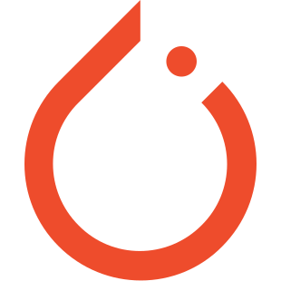

### Hi there, I'm Eric 👋

## About Me:
- 🎓 Full-time Medical Physicist and PhD student
- 👨‍💻 Interested in: AI, Image Reconstruction, Image Registration, Motion Correction
- 🔭 I’m currently working on: DeepLearning algorithms in Python
- 🌱 I’m currently learning: DeepLearning algorithms in Python and integration into the clinical routine

- Links:
  - [LinkedIn](https://www.linkedin.com/in/eric-einsp%C3%A4nner-82a049185/)
  - [ResearchGate](https://www.researchgate.net/profile/Eric-Einspaenner)
  - [ORCiD](https://orcid.org/0000-0003-2363-5132)

- Contact:
  - 📫 How to reach me: eric.einspaenner@med.ovgu.de

## 👨🏻‍💻 Languages/Tools:

